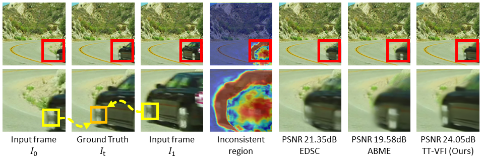
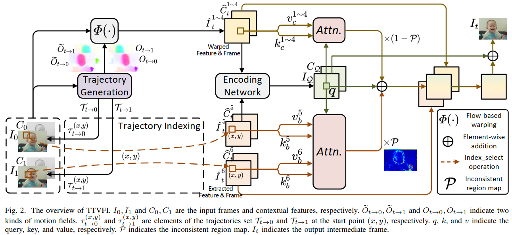
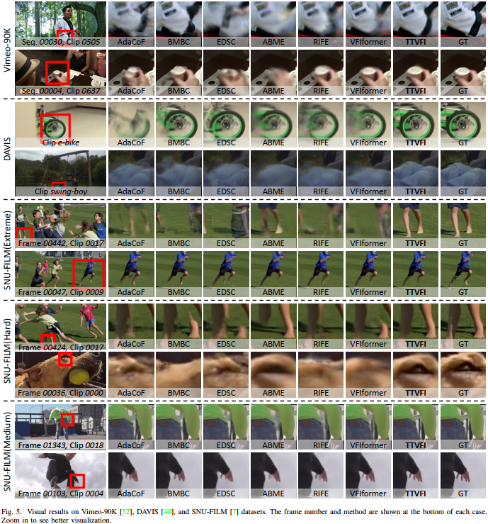

# TTVFI
This is the official PyTorch implementation of the paper [Learning Trajectory-Aware Transformer for Video Frame Interpolation](ArxivLink).

## Contents
- [Introduction](#introduction)
  - [Contribution](#contribution)
  - [Overview](#overview)
  - [Visual](#Visual)
- [Requirements and dependencies](#requirements-and-dependencies)
- [Model and Results](#model-and-results)
- [Dataset](#dataset)
- [Test](#test)
- [Train](#train)
- [Citation](#citation)
- [Contact](#contact)


## Introduction
<!-- We proposed an approach named TTVFI to study video super-resolution by leveraging long-range frame dependencies. TTVSR introduces Transformer architectures in video super-resolution tasks and formulates video frames into pre-aligned trajectories of visual tokens to calculate attention along trajectories. -->


### Contribution
<!-- We propose a novel trajectory-aware Transformer, which is one of the first works to introduce Transformer into video super-resolution tasks. TTVSR reduces computational costs and enables long-range modeling in videos. TTVSR can outperform existing SOTA methods in four widely-used VSR benchmarks.
 -->

### Overview


### Visual


## Requirements and dependencies
* python 3.6 (recommend to use [Anaconda](https://www.anaconda.com/))
* pytorch == 1.2.0
* torchvision == 0.4.0
* opencv-python == 4.5.5
* scikit-image == 0.17.2
* scipy == 1.1.0
* setuptools == 58.0.4
* Pillow == 8.4.0
* imageio == 2.15.0
* numpy == 1.19.5

Generate the Correlation package required by [PWCNet](https://github.com/NVlabs/PWC-Net/tree/master/PyTorch/external_packages/correlation-pytorch-master):
```
git clone https://github.com/ChengxuLiu/TTVFI.git
cd ./TTVFI/models/PWCNet/correlation_package_pytorch1_0/
./build.sh
```

## Model and Results
Pre-trained models can be downloaded from [onedrive](https://1drv.ms/u/s!Au4fJlmAZDhlhwjmP0D2RJOQaFqF?e=UHVz3H), [google drive](https://drive.google.com/drive/folders/1JWl22XUc0IOp1mx79_DRtwOwHjO1FP8I?usp=sharing), and [baidu cloud](https://pan.baidu.com/s/1nCjVhwArNajWFDDYwt4IUA)(j3nd).
* *TTVSR_stage1.pth*: trained from first stage with consistent motion learning.
* *TTVSR_stage2.pth*: trained from second stage with trajectory-aware Transformer on Viemo-90K dataset.

The output results on Vimeo-90K testing set, DAVIS, UCF101 and SNU-FILM can be downloaded from [onedrive](https://1drv.ms/u/s!Au4fJlmAZDhlhwjmP0D2RJOQaFqF?e=UHVz3H), [google drive](https://drive.google.com/drive/folders/1JWl22XUc0IOp1mx79_DRtwOwHjO1FP8I?usp=sharing), and [baidu cloud](https://pan.baidu.com/s/1nCjVhwArNajWFDDYwt4IUA)(j3nd).


## Dataset
1. Training set
	* [Viemo-90K](https://github.com/anchen1011/toflow) dataset. Download the [Both triplet training and test set](http://data.csail.mit.edu/tofu/dataset/vimeo_triplet.zip). The `tri_trainlist.txt` file listing the training samples in the download zip file.
		- Make Vimeo-90K structure be:
		```
			├────vimeo_triplet
				├────sequences
					├────00001
					├────...
					├────00078
				├────tri_trainlist.txt
				├────tri_testlist.txt
        ```

2. Testing set
    * [Viemo-90K](https://github.com/anchen1011/toflow) dataset. The `tri_testlist.txt` file listing the testing samples in the download zip file.
    * [DAVIS](https://github.com/HyeongminLEE/AdaCoF-pytorch/tree/master/test_input/davis), [UCF101](https://drive.google.com/file/d/0B7EVK8r0v71pdHBNdXB6TE1wSTQ/view?resourcekey=0-r6ihCy20h3kbgZ3ZdimPiA), and [SNU-FILM](https://myungsub.github.io/CAIN/) dataset.
		- Make DAVIS, UCF101, and SNU-FILM structure be:
		```
			├────DAVIS
				├────input
				├────gt
			├────UCF101
				├────1
				├────...
			├────SNU-FILM
				├────test
					├────GOPRO_test
					├────YouTube_test
				├────test-easy.txt			
				├────...		
				├────test-extreme.txt		
        ```

## Test
<!-- 1. Clone this github repo
```
git clone https://github.com/ChengxuLiu/TTVSR.git
cd TTVSR
```
2. Download pre-trained weights ([google drive](https://drive.google.com/drive/folders/1dXzyi_9nMLC3FU7SKkvLEGOMyv0lfcV2?usp=sharing)|[baidu cloud](https://pan.baidu.com/s/1xjGCnChxFxFcPs0cBVZ-ew)(nbgc)) under `./checkpoint`
3. Prepare testing dataset and modify "dataset_root" in `configs/TTVSR_reds4.py` and `configs/TTVSR_vimeo90k.py`
4. Run test
```
# REDS model
CUDA_VISIBLE_DEVICES=0,1,2,3,4,5,6,7 ./tools/dist_test.sh configs/TTVSR_reds4.py checkpoint/TTVSR_REDS.pth 8 [--save-path 'save_path']
# Vimeo model
CUDA_VISIBLE_DEVICES=0,1,2,3,4,5,6,7 ./tools/dist_test.sh configs/TTVSR_vimeo90k.py checkpoint/TTVSR_Vimeo90K.pth 8 [--save-path 'save_path']
```
5. The results are saved in `save_path`.
 -->
## Train
<!-- 1. Clone this github repo
```
git clone https://github.com/ChengxuLiu/TTVSR.git
cd TTVSR
```
2. Prepare training dataset and modify "dataset_root" in `configs/TTVSR_reds4.py` and `configs/TTVSR_vimeo90k.py`
3. Run training
```
# REDS
CUDA_VISIBLE_DEVICES=0,1,2,3,4,5,6,7 ./tools/dist_train.sh configs/TTVSR_reds4.py 8
# Vimeo
CUDA_VISIBLE_DEVICES=0,1,2,3,4,5,6,7 ./tools/dist_train.sh configs/TTVSR_vimeo90k.py 8
```
4. The training results are saved in `./ttvsr_reds4` and `./ttvsr_vimeo90k` (also can be set by modifying "work_dir" in `configs/TTVSR_reds4.py` and `configs/TTVSR_vimeo90k.py`) -->

## Citation
<!-- If you find the code and pre-trained models useful for your research, please consider citing our paper. :blush:
```
@InProceedings{liu2022learning,
author = {Liu, Chengxu and Yang, Huan and Fu, Jianlong and Qian, Xueming},
title = {Learning Trajectory-Aware Transformer for Video Super-Resolution},
booktitle = {CVPR},
year = {2022},
month = {June}
}
``` -->

## Contact
If you meet any problems, please describe them in issues or contact:
* Chengxu Liu: <liuchx97@gmail.com>

